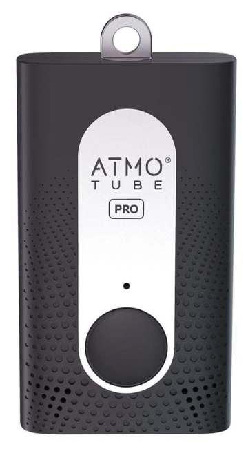
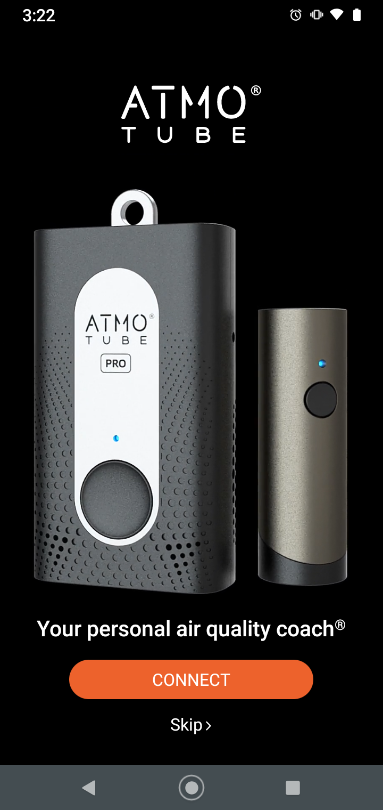
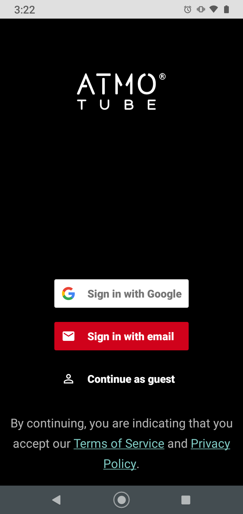
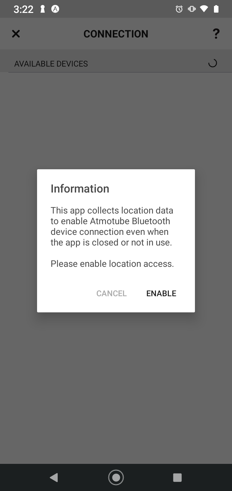
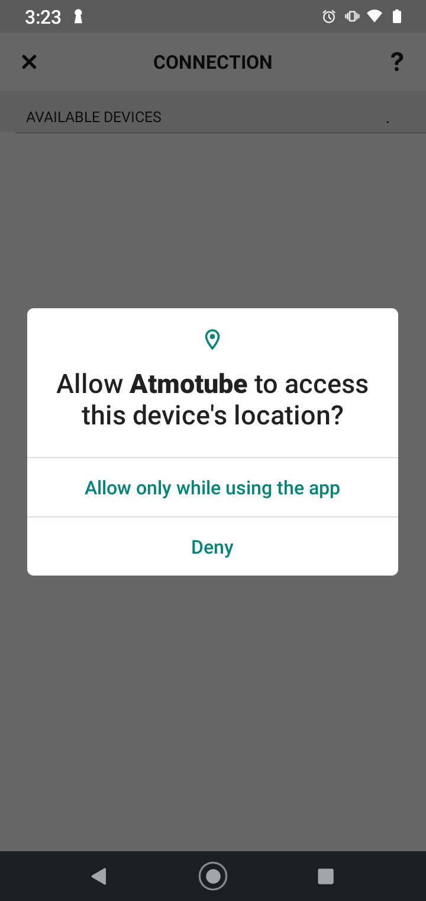
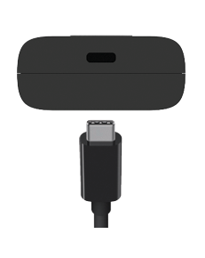
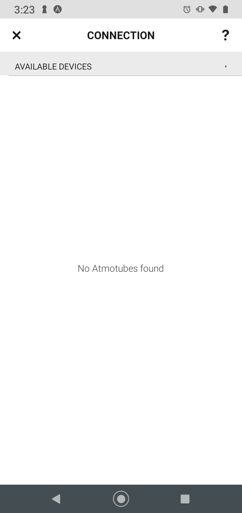

# Atmotube - Device Setup Manual

## About the Atmotube Pro

**Atmotube PRO** was created to raise awareness about both indoor and outdoor air quality, so you can make the right choices every day and live a healthier life.

**Atmotube PRO** detects **PM1**, **PM2.5**, and **PM10** pollutants, like dust, pollen, soot, and mold, plus a wide range of **Volatile Organic Compounds (VOCs)**. All in real time

**Atmotube PRO** also measures atmospheric pressure, temperature, and humidity, and helps you to stay in the most comfortable and safe environment.

**Atmotube PRO** weights 3.3 ounces (95 grams).

Each **Atmotube Pro** Bluetooth device has unique identifier - a MAC address (e.g., C1:2A:0D:AE:5A:C4).

## Installation Overview

- Install Android mobile application for Atmotube from Google Play Store
  - https://play.google.com/store/apps/details?id=com.atmotube.app&hl=en_US&gl=US 
- Configure participant id as device name
- Configure app settings so that data recording is consistent
- Place a sticker on back of device to label the unit

## Step-by-Step Walkthrough

1. Install Android mobile application for Atmotube from Google Play Store
   1. 
   2. https://play.google.com/store/apps/details?id=com.atmotube.app&hl=en_US&gl=US 
2. Open Atmotube app, and touch 'Connect'
   1. 
3. Touch 'Continue as Guest'
   1. 
4. Enable location services when prompted:
   1. 
   2. 
5. Charge the device
   1. You can turn the Atmotube on by connecting Atmotube to a 5V power source via a USB cable.
   2. Make sure your device  is fully charged. 
   3. To charge Atmotube, connect it to a power supply  for at least 2 hours using the USB Type-C cable from the box. 
   4. The **LED light will change its color from orange to green once the Atmotube is fully charged.**
   5. 
6. First Power On
   1. After the device has been switched on for the first time or after prolonged inactivity, the VOC sensor requires approximately three minutes to preheat. 
   2. While in preheating mode, the LED will blink orange; during this period, the device will be unresponsive and will not take any measurements.
7. Pair the Atmotube device
   1. Video walkthrough: [How to connect Atmotube PRO](https://www.youtube.com/watch?v=HozroMNMQKM)
8. Make sure to provide a carabiner, and lanyard to participant device, with default being a carabiner
   1. Purchase links: 
      1. Carabiner: TBD
      2. Lanyard: TBD
9. Place a sticker on back of device, vertically to label the unit, and provide study information.
   1. **Make sure to not cover any of the sensor holes on the device!**
10. Enter ID located on sticker into the device checkout log
    1. <u>*Device checkout log link coming soon!*</u>

## Troubleshooting

1. **Problem:** You are seeing a screen with no Atmotube devices available.
   1. 
   2. **Solution:** Make sure devices are charged, ON, and within 30 feet of the smartphone being paired.
2. **Problem:** You want to reboot the Atmotube Pro device.
   1. **Solution:** 
      1. To reboot Atmotube PLUS/PRO hold the button for approx. 7.5 seconds.
      2. Hold the Atmotube button, LED should light up
      3. After 4 seconds LED will become red
      4. Continue holding
      5. After 3.5 more seconds LED will start blinking red
      6. Release the button
      7. Atmotube is rebooted. LED starts blinking orange (VOC sensor heating)
3. **Problem:** You want to turn off the device.
   1. **Solution:** 
      1. Hold the button for 4 seconds until LED will light up
      2. Release the button
      3. Atmotube will start blinking orange (sensor heating)
   2. For more information, see the video walkthroughs: 
      1. [How to turn OFF Atmotube PRO](https://www.youtube.com/watch?v=OBcqtfQp-Fc)
      2. [How to turn ON Atmotube PRO](https://www.youtube.com/watch?v=-AtatSplzJo)
4. **Problem:** You want to unpair a device with a specific smartphone.
   1. **Solution:** 
      1. To unpair Atmotube quickly press its button five times. 
      2. If unpairing has been successful, Atmotube's LED light will blink blue 10 times.

For additional troubleshooting, please contact Dr. Nelson Roque at [nelson.roque@ucf.edu](nelson.roque@ucf.edu).

## Manufacturer's Device Manual

https://cdn.shopify.com/s/files/1/2156/7147/files/atmotube_pro_user_manual_v5_en.pdf?v=1653478212